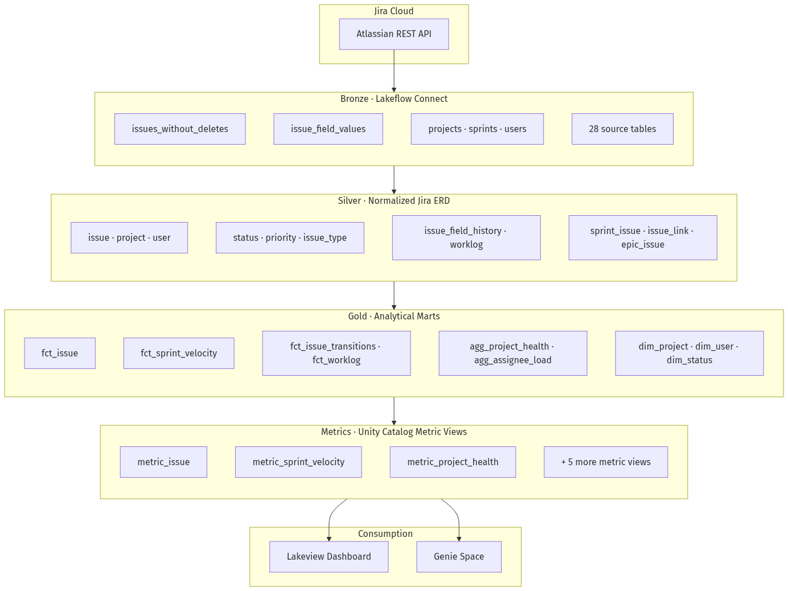

# Jira Genie

Turn Jira data ingested with [Lakeflow Connect](https://docs.databricks.com/en/connect/index.html)
into a governed delivery-analytics layer — pipelines, metrics, an AI/BI dashboard, and a Genie
space — in one deploy. It:

1. Builds standard pipelines: bronze -> silver (normalized Jira ERD) -> gold analytical marts
2. Creates Unity Catalog metric views defining governed Jira delivery KPIs
3. Deploys an AI/BI dashboard (Portfolio, Flow, Sprint, Team): created vs resolved, cycle time, velocity, workload
4. Provisions a curated Genie space for conversational analytics over the same metric views

## Deploy it

Pick one path. **Option A runs entirely inside Databricks — no local machine, no CLI on your laptop.**

### What you need first (both paths)

- A Unity Catalog **catalog** you can create schemas in
- A **SQL warehouse** (Serverless or Pro) — copy its ID
- A **Lakeflow Connect Jira connection** (Catalog Explorer -> Connections). The Jira connector is
  OAuth U2M only, so this one step is always interactive — [details](docs/prerequisites.md)

### Option A — From the Databricks UI (recommended)

Run the whole thing from a Git folder, straight from the workspace.

1. **Add the repo as a Git folder.** Sidebar -> **Workspace** -> pick a folder ->
   **Create -> Git folder** -> paste `https://github.com/DB-RKL/jira-genie.git`.
2. **Open [`deploy_jira_genie.py`](deploy_jira_genie.py)** (at the repo root) and attach it to a
   cluster (classic or serverless).
3. **Fill in the widgets** at the top — catalog, warehouse ID, Jira connection name, and what to
   deploy — then click **Run all**.

The notebook authenticates as you (no token to paste), writes your `config/pipeline.yaml`, installs
the Databricks CLI if the cluster does not already have it, and runs the same sync -> deploy ->
refresh steps as the CLI path. It deploys the `dev` target (runs as you; schemas are prefixed with
`dev_<user>_`) — for a production deployment use Option B. When it finishes, open
**AI/BI -> Dashboards** and **Genie**.

> Needs egress to `github.com` to fetch the CLI on first run. If your workspace blocks that, use
> Option B or ask an admin to pre-install the Databricks CLI on the cluster.

### Option B — From your local machine (CLI)

```bash
# 1. Clone and configure
git clone https://github.com/DB-RKL/jira-genie.git && cd jira-genie
cp config/pipeline.example.yaml config/pipeline.yaml
# Edit config/pipeline.yaml: catalog, warehouse_id, jira_connection_name, owner_email, profile

# 2. Authenticate, sync, and deploy (-p for dev so schema prefixes resolve)
databricks auth login --host https://<your-workspace>.cloud.databricks.com -p <profile>
./scripts/sync_config.sh -t dev -p <profile>
./scripts/deploy.sh      -t dev -p <profile>   # deploys everything except Genie (deferred)

# 3. Ingest, then build silver -> gold -> metric views
databricks bundle run jira_ingestion_pipeline -t dev -p <profile>
databricks bundle run jira_genie_setup        -t dev -p <profile>

# 4. Deploy the Genie space now that the metric views exist (full / with_genie only)
./scripts/deploy.sh -t dev -p <profile> --skip-sync --only-genie
```

Full walkthrough: [deployment guide](docs/deployment-guide.md).

## Data Model

Medallion pipeline from raw Jira ingestion through governed metric views:



| Layer | Schema | Key objects |
|-------|--------|-------------|
| Bronze | `bronze_schema` | 28 Lakeflow Connect source tables |
| Silver | `silver_schema` | Normalized ERD: `issue`, `project`, `user`, `sprint_issue`, history |
| Gold | `gold_schema` | Facts, dimensions, aggregates (`fct_issue`, `fct_sprint_velocity`, …) |
| Metrics | `metrics_schema` | 9 Unity Catalog metric views (dashboard + Genie SSOT) |

Detailed ER diagrams: [Silver ERD](docs/diagrams/jira_silver_er.png) · [Gold star schema](docs/diagrams/jira_gold_star_schema.png) · [Source (Mermaid)](docs/diagrams/)

## Before you deploy

Read these expectations up front so the first run matches what you see in docs and demos.

| Topic | What to expect |
|-------|----------------|
| **Lakeflow Connect Jira** | Preview connector; OAuth U2M only. You need a working Jira connection and at least one successful bronze ingestion before silver runs. The connecting user must be a **Jira admin** — ingestion pulls admin-scoped objects (security schemes, roles, statuses) and fails without it ([details](docs/prerequisites.md)). |
| **Deploy target** | `dev` (the default) prefixes schemas with `dev_<user>_` (e.g. `dev_jane_jira_silver`) and runs as you. `prod` uses plain names and runs unattended as a service principal — see the [deployment guide](docs/deployment-guide.md). |
| **Genie is deployed last** | Creating a Genie space validates that its metric views already exist, so `deploy.sh` defers it (for `full` / `with_genie`) until after the setup job builds the metric views. Option A and the deployment guide handle this ordering for you. |
| **Sprint analytics** | Sprint velocity widgets need sprint membership on issues (`issues.sprint_ids` from Connect). Without it, sprint charts may be empty even when other KPIs look fine. |
| **Deployment profiles** | `pipeline_only` runs ingest -> silver -> gold only. Add metrics, dashboard, or Genie via [deployment profiles](docs/deployment-profiles.md). |
| **Local CLI path only** | If you deploy with Option B, run `./scripts/sync_config.sh` before every `bundle validate` / `deploy` — it patches `databricks.yml` and regenerates the metric SQL, Genie JSON, and dashboard. Option A does this for you. |

Full checklist: [prerequisites](docs/prerequisites.md) · [deployment guide](docs/deployment-guide.md) · [post-deployment](docs/post-deployment.md).

## Documentation

| Page | Description |
|------|-------------|
| [docs/index.md](docs/index.md) | Overview, architecture, and design principles |
| [docs/prerequisites.md](docs/prerequisites.md) | Workspace requirements and tooling |
| [docs/configuration.md](docs/configuration.md) | `pipeline.yaml` field reference |
| [docs/deployment-profiles.md](docs/deployment-profiles.md) | Five deployment profile options |
| [docs/deployment-guide.md](docs/deployment-guide.md) | Step-by-step deployment (UI and CLI) |
| [docs/post-deployment.md](docs/post-deployment.md) | Running jobs, scheduling, troubleshooting |
| [docs/architecture.md](docs/architecture.md) | Data flow and table inventory |
| [docs/data-model.md](docs/data-model.md) | Layered data model diagrams (PNG + Mermaid source) |
| [docs/extending.md](docs/extending.md) | Adding metric views and dashboard widgets |

## License

Apache License 2.0 — see [LICENSE](LICENSE).
