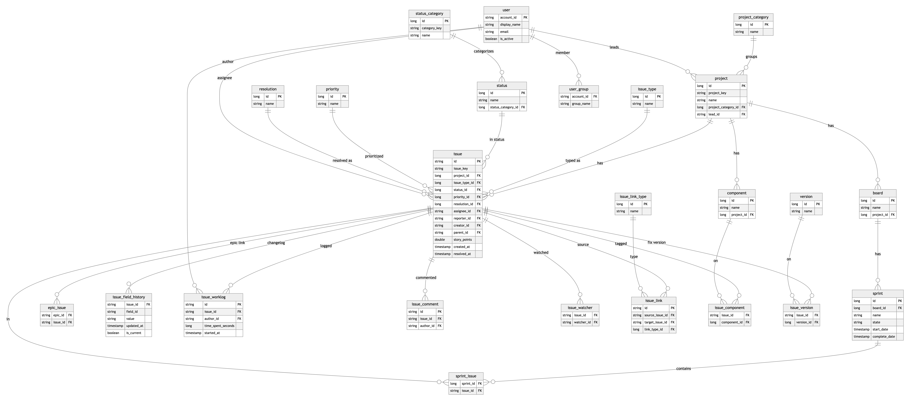
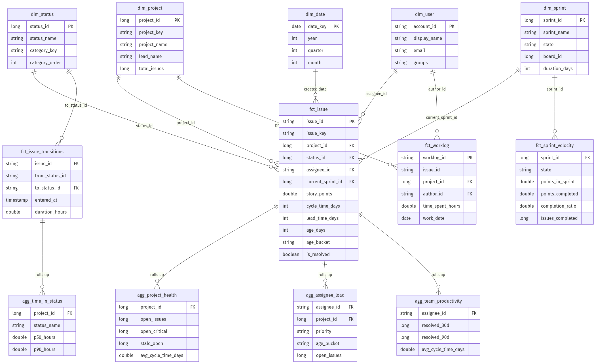

# Architecture

## Data Flow


See [data-model.md](data-model.md) for full ER diagrams and regeneration instructions.

```
databricks.atlassian.net
        │
        ▼
Lakeflow Connect (28 Jira source tables)
        │
        ▼
bronze.*  ──►  silver.* (normalized Jira ERD)  ──►  gold.* (marts)
                                                        │
                                                        ▼
                                              metrics.* (8 metric views)
                                                        │
                              ┌─────────────────────────┴─────────────────────────┐
                              ▼                                                   ▼
                   Lakeview dashboard                                  Genie space
```

## Layers

| Layer | Schema var | Contents |
|-------|-----------|----------|
| Bronze | `bronze_schema` | Raw Lakeflow Connect landing (28 tables) |
| Silver | `silver_schema` | Normalized ERD: issue, project, user, status, links, history |
| Gold | `gold_schema` | Facts (`fct_issue`, `fct_sprint_velocity`, …), dimensions, aggregates |
| Metrics | `metrics_schema` | Unity Catalog metric views (SSOT for dashboard + Genie) |

## Bronze Tables (Lakeflow Connect)

28 source tables including `issues_without_deletes`, `issue_field_values`, `projects`, `sprints`, `users`, and lookup tables. The silver layer maps Lakeflow camelCase columns to canonical delivery table names.

## Silver ERD

Python DLT pipelines in `src/silver/`:

- `core_entities.py` — issue, project, user, status, priority
- `issue_history.py` — field history, worklogs, watchers
- `relationships.py` — links, sprints, epics, components, versions
- `lookups.py` — boards, sprints, groups, permission schemes
- `apply_comments.py` — applies Unity Catalog table and column comments to bronze and silver

Table and column comments are defined in `src/silver/bronze_comments.py` and `src/silver/silver_comments.py`, then applied on each silver pipeline run.

See [data-model.md](data-model.md) for the full silver ER diagram.



### Data Quality Expectations

The silver layer enforces DLT data quality expectations to ensure referential integrity and completeness:

| Expectation | Tables | Behavior | Impact |
|------------|--------|----------|--------|
| **Primary key not null** | `issue`, `project`, `user` | `expect_or_fail` — pipeline fails on null ID | Ensures core entities are always valid |
| **Lookup ID not null** | `status`, `priority`, `resolution`, `issue_type`, `issue_comment`, and dimension/bridge tables | `expect_or_drop` — rows with null IDs are filtered out | Prevents orphaned dimension rows |
| **History FK not null** | `issue_field_history`, `issue_multiselect_history` | `expect_or_drop` on `issue_id` and `field_id` — rows missing these are dropped | Prevents orphaned change records |

A failed `expect_or_fail` halts the pipeline update; filtered `expect_or_drop` rows are recorded in the DLT expectations audit tables.

## Gold Marts

SQL DLT materialized views in `src/gold/`:

- `fct_issue` — denormalized issue fact with cycle/lead time
- `fct_sprint_velocity` — sprint planning vs completion
- `fct_issue_transitions` — workflow transitions with duration
- `fct_worklog` — logged hours
- `aggregates.sql` — project health, assignee load, team productivity, time in status

See [data-model.md](data-model.md) for the full gold star schema diagram.



## Metric Views

Defined in [`src/metrics/metric_views.sql.tmpl`](../src/metrics/metric_views.sql.tmpl), generated at sync time into `src/metrics/metric_views.sql`. Created by the `build_metrics` task in `jira_analytics_setup`.

Metric views model star-schema **relationships** via YAML `joins` blocks (visible in Catalog Explorer under **Data model → Relationships**):

| Metric view | Fact / aggregate source | Dimension joins |
|-------------|-------------------------|-----------------|
| `metric_issue` | `fct_issue` | `dim_project`, `dim_user` (assignee, reporter), `dim_status`, `dim_sprint` |
| `metric_sprint_velocity` | `fct_sprint_velocity` | `dim_project`, `dim_sprint` |
| `metric_issue_transitions` | `fct_issue_transitions` | `dim_project`, `dim_status` |
| `metric_worklog` | `fct_worklog` | `dim_project`, `dim_user` (author) |
| `metric_project_health` | `agg_project_health` | `dim_project` |
| `metric_assignee_load` | `agg_assignee_load` | `dim_user`, `dim_project` |
| `metric_team_productivity` | `agg_team_productivity` | `dim_user` |
| `metric_time_in_status` | `agg_time_in_status` | `dim_project`, `dim_status` |
| `metric_flow` | `vw_created_resolved_daily` | `dim_project` |

## Bundle Structure

```
config/pipeline.yaml          ← customer edits this
databricks.yml                ← patched by sync_config.sh
resources/common/             ← UC schemas (all profiles)
resources/<profile>/          ← pipelines, jobs, dashboard, Genie
scripts/sync_config.sh        ← config → bundle + artifacts
src/silver/  src/gold/        ← transformation code
src/metrics/                  ← metric view template + generated SQL
dashboards/                   ← generated Lakeview JSON
```

## Orchestration

`jira_analytics_setup` job runs four tasks sequentially (profiles with metrics add a fifth):

1. `ingest_bronze` — Lakeflow Connect pipeline
2. `build_silver` — Silver DLT pipeline (applies bronze/silver UC comments)
3. `build_gold` — Gold DLT pipeline (applies gold UC comments)
4. `build_metrics` — SQL task executing generated metric views (`with_metrics`, `with_dashboard`, `with_genie`, `full` only)
