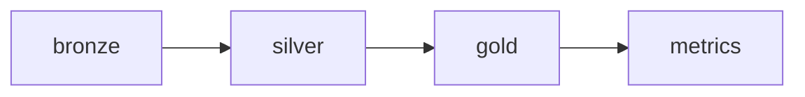

# Data Model

Visual reference for the Jira Analytics medallion architecture and entity relationships.

## Overview

End-to-end flow from Jira Cloud through bronze, silver, gold, and metrics layers to dashboard and Genie:


**Source:** [`diagrams/jira_data_model_overview.mmd`](diagrams/jira_data_model_overview.mmd)

## Silver — Normalized Jira ERD

Python DLT transforms Lakeflow Connect bronze tables into a normalized entity-relationship model:


**Source:** [`diagrams/jira_silver_er.mmd`](diagrams/jira_silver_er.mmd)

Key entity groups:

| Group | Tables |
|-------|--------|
| Core | `issue`, `project`, `user`, `status`, `priority`, `issue_type` |
| History | `issue_field_history`, `issue_multiselect_history`, `issue_worklog` |
| Relationships | `sprint_issue`, `epic_issue`, `issue_link`, `issue_component` |
| Lookups | `board`, `sprint`, `permission_scheme`, `user_group` |

## Gold — Star Schema & Aggregates

SQL DLT materialized views for delivery analytics:


**Source:** [`diagrams/jira_gold_star_schema.mmd`](diagrams/jira_gold_star_schema.mmd)

| Type | Objects |
|------|---------|
| Facts | `fct_issue`, `fct_sprint_velocity`, `fct_issue_transitions`, `fct_worklog` |
| Dimensions | `dim_project`, `dim_user`, `dim_status`, `dim_sprint`, `dim_date` |
| Aggregates | `agg_project_health`, `agg_assignee_load`, `agg_team_productivity`, `agg_time_in_status` |

## Metrics — Semantic Layer

Nine Unity Catalog metric views sit on top of gold marts and power both the Lakeview dashboard and Genie space. See [architecture.md](architecture.md#metric-views). `metric_flow` is sourced from `vw_created_resolved_daily` (created vs resolved by day).

## Regenerating Diagrams

Mermaid source files live in [`docs/diagrams/`](diagrams/). To re-render PNGs after editing:

```bash
./scripts/render_diagrams.sh
```

Uses `mmdc` if installed; otherwise falls back to the Kroki.io API.

GitHub also renders `.mmd` files when embedded in markdown:

````markdown

````
