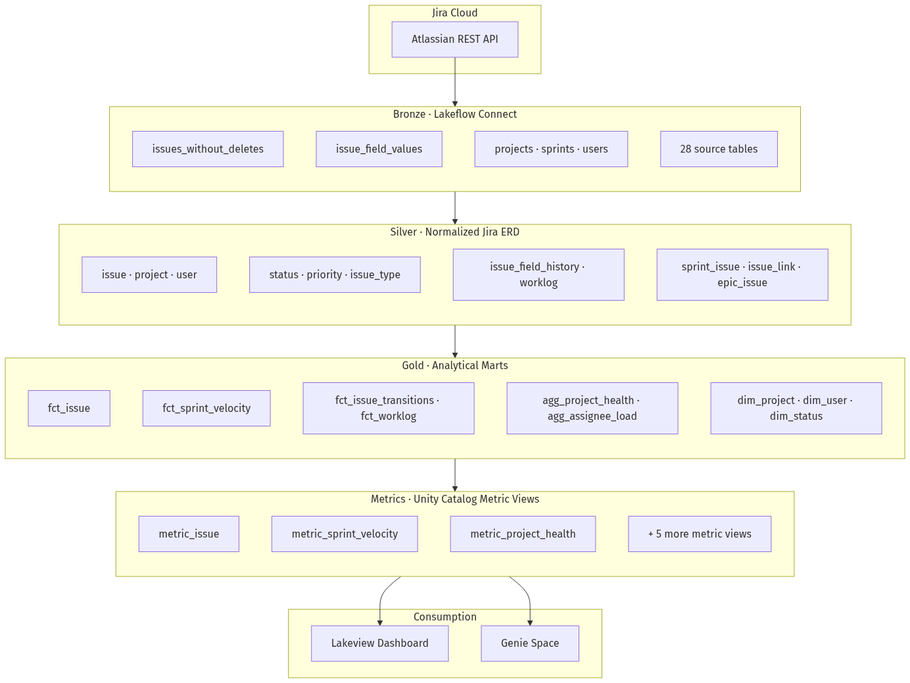

# Jira Analytics — Lakehouse Quickstart

Jira Analytics is a reusable accelerator that builds a standardized Jira delivery analytics layer on top of data ingested via [Lakeflow Connect](https://docs.databricks.com/en/connect/index.html). It bridges the gap between raw Jira ingestion and actionable insights by providing a normalized Jira ERD, analytical gold marts, Unity Catalog metric views, an AI/BI dashboard, and a curated Genie workspace.

## The Problem

Customers ingesting Jira data via Lakeflow Connect still need significant transformation logic before the data becomes usable for delivery analytics — sprint velocity, cycle time, portfolio health, and team productivity. This delays time-to-value for engineering and program leaders.

## What Jira Analytics Provides

- **Standardized transformation pipelines** — bronze → silver (normalized Jira ERD) → gold marts
- **Unity Catalog metric views** — governed KPIs with `MEASURE()` for dashboard and Genie
- **AI/BI dashboard** — four audience pages: Portfolio (created vs resolved), Flow, Sprint, and Team
- **Curated Genie workspace** — natural-language Q&A over the same metric views

## Architecture



See [architecture.md](architecture.md) and [data-model.md](data-model.md) for full diagrams and table inventory.

## Key Design Principles

- **Config-driven**: A single YAML file (`config/pipeline.yaml`) drives all deployment decisions
- **Modular deployment**: Choose from five deployment profiles to deploy only what you need
- **Semantic layer SSOT**: Eight metric views are the single source of truth for dashboard and Genie
- **Serverless**: All compute runs on serverless infrastructure

## Quick Start

```bash
cp config/pipeline.example.yaml config/pipeline.yaml
# Edit config/pipeline.yaml

./scripts/sync_config.sh -t dev -p <your-profile>
./scripts/deploy.sh -t dev -p <your-profile>
databricks bundle run jira_analytics_refresh -t dev -p <your-profile>
```

See the [deployment guide](deployment-guide.md) for detailed instructions.
